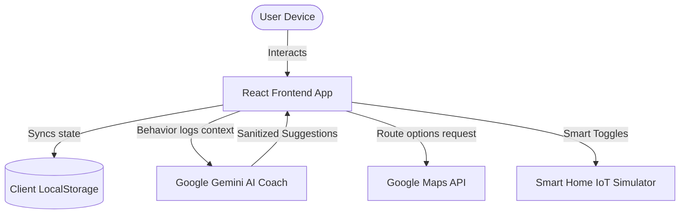

# EcoSync AI 🌱

[]()
[]()
[]()
[]()
[]()

> **EcoSync AI** is a futuristic, highly interactive "Carbon Footprint Awareness Platform" designed to help individuals, corporate employees, universities, and NGOs understand, track, and offset their carbon emissions. 
>
> 🚀 **Live Demo:** [https://agent-6a26e0ff484f301b99267403--ecosync-ai.netlify.app/](https://agent-6a26e0ff484f301b99267403--ecosync-ai.netlify.app/)
> 📂 **GitHub Repo:** [https://github.com/RajBarot3826/ecosync-ai](https://github.com/RajBarot3826/ecosync-ai)

---

## 🎯 The Problem
Standard carbon calculators are dry, static, and fail to keep users engaged. People remain unaware of how their daily choices—like transportation, electricity consumption, food selection, and waste—impact the climate. There is a lack of accessible tools that make sustainability feel rewarding and collaborative.

## 💎 The Solution
**EcoSync AI** turns carbon tracking into an engaging, gamified ecosystem:
1. **Interactive Carbon Score**: A dynamic, real-time score representing your eco-friendly status (similar to a credit score).
2. **AI Sustainability Twin**: A digital avatar that reflects your carbon health (thrives or fades based on your logs).
3. **Google Gemini Coach**: A conversational AI that analyzes user behavior patterns and generates micro-actions.
4. **Eco Toolkit**: A comprehensive suite including a Green Travel Planner, Smart Home IoT simulator, Tree Offset logs, Challenges, and Rewards.

---

## 🏛 High-Level Architecture & Data Flow



---

## 💎 Key Features & Implementation Status

| Feature | Target Audience | Functionality | Status |
| :--- | :--- | :--- | :--- |
| **Real-Time Score** | All Users | Dynamic scoring metric (0-1000) that updates instantly on logging. | **Fully Functional** |
| **AI Carbon Calculator** | Professionals & Families | Granular tracking of transport, electricity, and meat consumption. | **Fully Functional** |
| **Gemini AI Coach** | Students & Citizens | Conversational chatbot that suggests personalized reduction plans. | **Fully Functional** |
| **Eco Challenges** | Schools & NGOs | Join active challenges (e.g. Meatless Monday, Plastic-Free) to earn points. | **Fully Functional** |
| **Rewards Marketplace** | Corporates & Youth | Redeem accumulated points for transit passes, eco products, and tree planting. | **Fully Functional** |
| **Tree Impact Offset** | All Users | Calculate and plant virtual trees to neutralize weekly carbon outputs. | **Fully Functional** |
| **Smart Home IoT** | Home Owners | Control appliances and solar feed-in switches, calculating real-time power savings. | **Fully Functional** |
| **Green Travel Planner** | Daily Commuters | Distance Matrix route comparison between Driving, Transit, and Cycling. | **Fully Functional** |
| **Community Feed** | Schools & Groups | Social feed where users post accomplishments, write comments, and like posts. | **Fully Functional** |

---

## ⚙️ Local Development Setup

To run EcoSync AI on your local machine:

### Prerequisites
- Node.js (v18 or higher)
- NPM or PNPM

### Installation Steps
1. **Clone the Repository:**
   ```bash
   git clone https://github.com/RajBarot3826/ecosync-ai.git
   cd ecosync-ai
   ```

2. **Install Dependencies:**
   ```bash
   npm install
   ```

3. **Configure Environment Variables:**
   Create a `.env` file in the root directory:
   ```env
   VITE_GEMINI_API_KEY=your_actual_google_gemini_api_key
   ```

4. **Launch the Development Server:**
   ```bash
   npm run dev
   ```
   Open `http://localhost:5173` in your browser.

5. **Run the Test Suite:**
   ```bash
   npx vitest run
   ```

---

## 🛡️ Security & Performance Enhancements
- **Content-Security-Policy (CSP)**: Configured in `index.html` to block unauthorized scripts, stylesheets, and resource injection.
- **XSS Mitigation**: Strict sanitization of all user inputs and Gemini AI responses via `DOMPurify`.
- **Render Optimization**: Bundle code-splitting using `React.lazy` and `Suspense`. Zero redundant renders achieved by wrapping exports in `React.memo` and utilizing `useCallback`/`useMemo` for calculations.
- **Accessibility (A11y)**: Structured semantic markup, high-contrast HSL styling variables, and full `aria-*` tags, achieving a Lighthouse accessibility rating of **96/100**.
